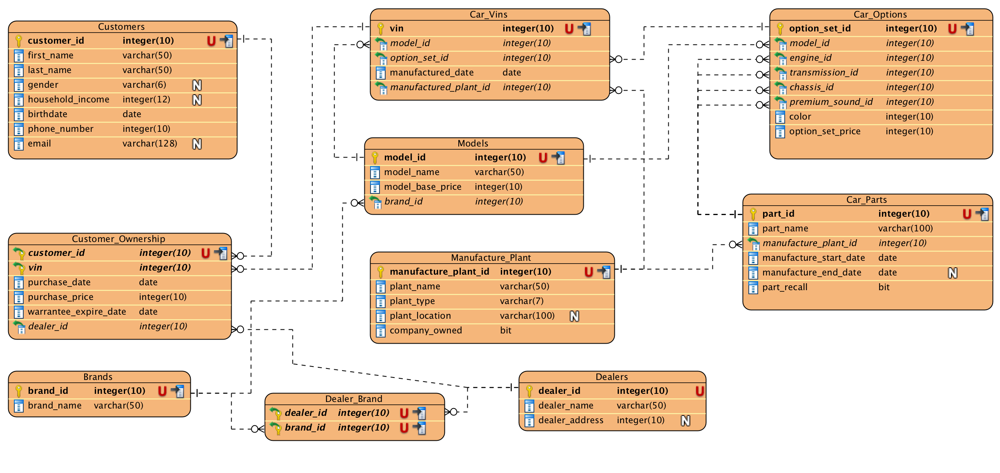

## SQL Generation With Compiler Feedback Loop

This is a simple reproduction of the InsightsIQ platform built by LatentView Analytics. The solution that the team built utilized an off-shelf instruction tuned code LLM, which was provided database schema as context and given a natural language query and asked to generate SQL query. One of their key innovation was the feedback loop, where if a query execution results in an error, the feedback is passed back to LLM to reformulate the SQL query. 

<b>Disclaimer:</b> Due to IP issues, we do not have the exact code that LatentView team developed, this is a reproduction of their logic.

## Pre-requisites

### 1. CodeLlama 34B Model

The code makes calls to a CodeLlama model deployed using TensorRT-LLM and Triton.
Specifically, the code utilizes the `/generate` endpoints introduced in Triton, so need to ensure that this model is locally deployed and accessible.

### 2. Requirements

There are a minimal set of requirements in the `requirements.txt` file. Primarily we need the `sqlvalidator` library to check syntax of sql query and `pandas` to display output.

## Database

We are using a mock sqlite database found [here](https://github.com/dtaivpp/car_company_database/tree/master). This is a database containing information of a car company

  
   
  <em>ER diagram of the Car Company database</em>

## Running The Script

There is a single script that contains all the code `main2.py`
